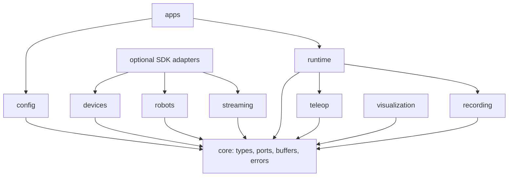
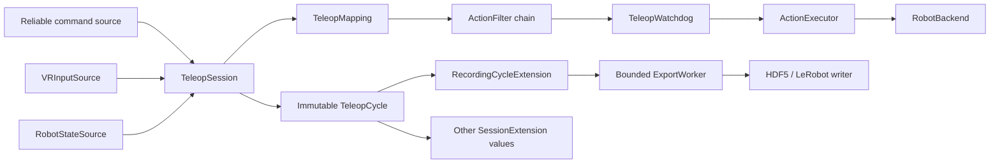

# AIRO-Doffy v2 Architecture

## Purpose and status

The v2 architecture separates real-time robotics concerns into replaceable,
typed components. The library provides ports, adapters, processing stages,
runtime orchestration, and compatibility boundaries. A deployment composition
factory selects concrete devices and policies.

The architecture is implemented and mock-tested. It is not a claim that every
possible hardware composition has been validated. In particular, production
composition must choose a state source that respects the selected robot SDK's
thread-affinity rules.

## Design rules

1. Immutable samples cross component boundaries.
2. Hardware SDK imports stay inside adapters and are delayed until lifecycle
   start or the first SDK operation.
3. Protocol parsing, device I/O, processing, storage, visualization, and
   orchestration are separate responsibilities.
4. High-rate state is latest-only; reliable commands use a distinct ordered
   path.
5. Real-time queues are bounded and expose their drop behavior.
6. Runtime owns thread handles and shuts resources down in reverse start order.
7. Background exceptions become observable health errors.
8. Compatibility formats do not change without explicit migration notes and
   tests.

## Modules and responsibilities

| Module | Responsibility | Must not own |
|---|---|---|
| `core` | immutable models, clocks, errors, interfaces, latest buffers | devices, SDKs, sockets |
| `config` | typed sections, layered loading, lazy factories | component lifecycles |
| `devices.cameras` | camera acquisition and mocks | encoding, network transport |
| `devices.vr` | VR decoding, aggregation, stale rejection, mocks | video, robot actions |
| `devices.tactile` | BLE4 acquisition, calibration, filters, mocks | camera, VR, recorder |
| `devices.wrench` | source, compensation, filtering pipeline | visualization, datasets |
| `robots` | atomic robot/gripper adapters and command executors | VR parsing, UI, recording |
| `teleop.transforms` | pure pose math | I/O, mutable state |
| `teleop.mappings` | VR + robot state to candidate action | SDK calls, safety enforcement |
| `teleop.safety` | limits, freshness, IK validation, watchdog | transport or storage |
| `streaming.video` | frame processing, encoding, video delivery | camera discovery |
| `streaming.state` | binary latest-state delivery | reliable runtime commands |
| `streaming.commands` | reliable command envelope, dedupe, routing | robot motion mapping |
| `recording` | schema, episode state, buffers, writers, export | device reads, control cadence |
| `visualization` | typed snapshots, latest consumer, UI commands | mutable component internals |
| `runtime` | lifecycle and session coordination | device/protocol implementation |
| `apps` | CLI, configuration load, composition-factory handoff | hardware selection policy |

## Dependency direction



Supported package code does not import `deprecated/`. Root modules may remain as
compatibility facades and load legacy code only when a legacy symbol is used.

## Runtime data flow



One `TeleopSession` cycle:

1. Drain typed runtime commands.
2. Read one immutable robot state and the latest VR input.
3. Evaluate stale-input watchdog state.
4. Map VR input and robot state to a candidate action.
5. Apply the injected safety-filter chain.
6. Convert missing/rejected/stale input to a monotonic HOLD or zero-velocity
   action.
7. Submit the safe action to a caller-owned executor.
8. Publish one immutable `TeleopCycle` to extensions.

`DataCollectionSession` delegates this same loop. Recording is an extension, not
a second control loop.

## Samples, clocks, and sequence numbers

All high-rate domain values extend `SequencedSample` and carry:

- a non-negative sequence;
- source timestamp in nanoseconds;
- optional receive timestamp;
- an explicit clock domain.

Payload arrays are converted to immutable tuples or detached bytes. Components
must not attach arbitrary attributes to another object or retain mutable SDK
buffers after publishing.

Sequence-aware buffers reject stale or duplicate values, including explicit
32-bit wrap handling where the wire protocol uses `uint32`.

## Loop and thread ownership

The following table describes intended production ownership. A component may be
synchronous when called by an externally owned loop, but hidden untracked
threads are not allowed.

| Loop | Input / output | Target | Owned resources | Buffer and drop |
|---|---|---|---|---|
| RealSense acquisition | SDK images -> `CameraFrame` | `camera.capture_rate_hz` | one camera handle and worker | color/depth latest-only; overwrite old |
| video encoding | `ProcessedFrame` -> `EncodedFrame` | arrival-driven, configured FPS upstream | one encoder and worker | bounded input/output; drop oldest |
| WebRTC delivery | encoded frame -> video track | `video.target_fps` | peer connection and event loop | latest per stream; reject stale |
| UDP/RTP delivery | encoded frame -> datagrams | caller-driven | one socket | no frame backlog; packetize current frame |
| VR receive | raw message -> `VRInputState` | transport-driven, bounded polling | raw transport and worker | latest-only; reject stale/malformed |
| generic robot execution | safe action -> SDK action | executor `target_hz` | backend on managed owner thread | latest action; reject stale |
| RealMan CAN-FD | latest target -> high-follow setpoint | `realman_control_rate_hz` | backend SDK owner thread | latest target; slew-limit current |
| robot state acquisition | SDK/cache -> `RobotState` | deployment-specific | SDK owner or state-push callback | latest-only; reject stale |
| tactile acquisition | BLE callback -> `TactileSample` | device-driven | BLE/DDS source | private latest; disconnect clears |
| dataset export | sealed episode -> storage | task-driven | one writer and worker | bounded FIFO; reject when full |
| visualization | snapshot -> renderer | publisher-driven, UI refresh limited | renderer and worker | latest-only; overwrite old |
| teleop session | state + VR + commands -> action + cycle | selected control rate | orchestration thread only | no unbounded queue |

### Robot state composition constraint

`TeleopSession` depends on the narrow `RobotStateSource` port. Passing a backend
directly is valid for mocks and for SDKs that explicitly allow synchronous reads
on the session thread. When a vendor SDK is thread-affine or state reads involve
network I/O, the deployment must inject an executor-owned cache or a dedicated
state-push source instead.

The library does not silently create a concurrent reader for a shared SDK
handle. RealMan's production composition must preserve its single SDK owner and
use realtime state push or scheduled owner-thread polling. This remains a
hardware-validation item before a release candidate.

## Lifecycle and shutdown

Every owned component implements `start()` and idempotent `close()`.
`LifecycleManager`:

- starts in declaration order;
- records only successful starts;
- rolls back partial startup in reverse order;
- closes all started resources even if one close fails;
- exposes immutable state and error snapshots.

`ManagedWorker` owns one non-daemon thread by default, supplies a stop event,
captures failures, and requires a bounded join during close.

`TeleopSession` starts:

1. action executor/backend;
2. managed executor worker;
3. VR source;
4. extensions.

It closes in reverse order. Extensions stop before VR, the executor worker is
joined before the executor closes its backend, and Ctrl+C becomes a cooperative
stop request.

A component whose thread does not stop before its configured timeout raises
`LifecycleError`; the runtime does not pretend cleanup succeeded.

## Error model

| Error | Meaning |
|---|---|
| `ModelValidationError` | invalid typed value, config, packet, or component contract |
| `LifecycleError` | invalid start/run/close state or worker failure |
| `OptionalDependencyError` | selected adapter requires an uninstalled extra |
| `ProtocolError` | invalid version, length, CRC, enum, or payload |
| `CommandRejectedError` | valid command cannot run in the current state |
| recording errors | schema, export, rollback, or queue failure |

Hot paths update immutable metrics and retain a short last-error description.
Worker exceptions are surfaced by `check_health()` and stop the owning loop.

Safety behavior is explicit:

- missing VR input produces HOLD even without a configured watchdog;
- stale VR or robot state moves the watchdog to a safe state;
- rejected safety-filter output becomes HOLD rather than repeating an old
  active command;
- STOP is terminal for an executor.

## Configuration and composition boundary

Configuration is merged before components start. Factories receive only the
sections they need and resolve `module:symbol` targets lazily. The application
entry point then calls a deployment composition factory:

```python
def build_teleop(config: AiroDoffyConfig) -> ApplicationSession:
    ...
```

This factory owns workcell policy:

- selected hardware and transports;
- SDK-safe robot state source;
- mapping and safety limits;
- optional gripper, tactile, cameras, writer, and visualizer;
- lifecycle ordering and deployment diagnostics.

The library deliberately has no universal production default for these choices.

## Extension points

New implementations should target the smallest protocol:

- `RobotBackend`, `ActionExecutor`, `RobotStateSource`
- `Gripper`
- `CameraSource`
- `VRInputSource` or `RawVRTransport`
- `TactileSensor`, `WrenchSource`
- `FrameProcessor`, `VideoEncoder`, `VideoTransport`
- `TeleopMapping`, `ActionFilter`
- `EpisodeWriter`, `EpisodeRollback`
- `SnapshotConsumer`, `SnapshotRenderer`
- `SessionExtension`

See [extension_guide.md](extension_guide.md) for implementation and testing
checklists.

## Known release constraints

- No built-in production session factory chooses a workcell automatically.
- Root compatibility applications still contain legacy orchestration.
- RealMan realtime state-push composition remains in the compatibility path.
- Policy adapters are not yet moved into `src/airo_doffy/policies`.
- HDF5 integration requires the optional `h5py` dependency.
- Physical hardware, disconnect, stop, force-frame, and timing behavior must be
  validated under supervision before tagging a release candidate.
